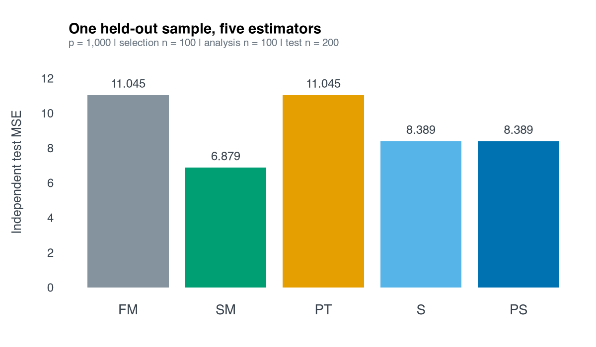

# HDMaxShrink

Methodology preprint: [Max-Test-Calibrated Stein Shrinkage with Honest Submodel
Selection in Ultra-High-Dimensional Regression](https://arxiv.org/abs/2609.23070)
(Bahadır Yüzbaşı, 2026; arXiv:2609.23070, stat.ME). The preprint includes
supplementary material.

HDMaxShrink is a research package for pretest--Stein estimation in sparse
linear models with $`p\gg n`$. It provides full-model (FM), submodel (SM),
preliminary-test (PT), Stein-form (S), and positive-part (PS) estimates.

The current data-adaptive workflow combines independent-sample submodel
selection with a Ridge full model and max-test-calibrated shrinkage. CPSS and
post-selection refitting are established methods; the proposed contribution
is their honest integration with an exact-null SVD submodel, a dual-Ridge
full endpoint, and a conditionally calibrated max-partial-$`t`$ PT/Stein
family. Classical James--Stein dominance is not asserted.

Start with [installation](#install-and-try) and the self-contained example.
The [current workflow](#current-workflow-cpss-guided-submodel-and-ridge-full-model),
[additional square-root-LASSO workflow](#additional-workflow-prespecified-core-square-root-lasso),
and [retained research modes](#retained-research-modes) are described separately below.

## Install and try

Source repository: <https://github.com/byuzbasi/HDMaxShrink>.

```r
# Install remotes first if it is not already available.
install.packages("remotes")
remotes::install_github("byuzbasi/HDMaxShrink", upgrade = "never")
```

R >= 4.1.0 and a working C++17 toolchain are required. The package links to
R's LAPACK/BLAS and uses RcppArmadillo. The optional CPSS-MCP selector also
requires `grpreg`, listed under Suggests; install it separately if needed.

Run the small, self-contained example after installation:

```r
source(system.file("examples", "quickstart.R", package = "HDMaxShrink"))
```

The example generates 1,000 predictors with independent selection and analysis
samples of 100 observations each, plus 200 untouched test observations. It prints
the selected submodel, test diagnostics and FM/SM/PT/S/PS results, and draws a
test-error plot in an interactive R session. It is one toy dataset, not a
reproduction of the manuscript's production study. The complete script is
[quickstart.R](inst/examples/quickstart.R); the steps below can also be run in order.

## Current workflow: CPSS-guided submodel and Ridge full model

### 1. Generate data with known coefficients

The design entries and errors below are independent standard Gaussian draws.
Only the first ten coefficients are nonzero; the generating intercept is zero.
Separate data are used for selection, estimation and evaluation. The true
coefficient vector is used for data generation and scoring, never supplied to
the selector or estimator.

```r
library(HDMaxShrink)
set.seed(20260914)
n <- 100L
p <- 1000L
n_test <- 200L
beta <- c(1.50, 1.25, 1.00, 0.90, 0.80,
          -1.25, -1.00, -0.90, 0.75, -0.75, rep(0, p - 10L))
make_sample <- function(rows = n) {
  X <- matrix(rnorm(rows * p), nrow = rows, ncol = p)
  colnames(X) <- paste0("x", seq_len(p))
  list(X = X, y = drop(X %*% beta + rnorm(rows)))
}
selection_data <- make_sample()
analysis_data <- make_sample()
test_data <- make_sample(n_test)
```

### 2. Learn the submodel from selection data only

Assume that only `x1` and `x2` are required predictors known in advance. CPSS
can add predictors from the remaining 998 columns. The other eight signals
are not given to it, and successful support recovery is not assumed. This
small demonstration uses 20 complementary pairs, a base-selection budget of
10 optional variables and a stability threshold of 0.60.

```r
selection <- cpss_select_core(
  selection_data$X, selection_data$y,
  selector = "lasso", mandatory_core = 1:2,
  complementary_pairs = 20L, base_selection_size = 10L,
  stability_threshold = 0.60, path_points = 30L, seed = 20260915L
)
core_table <- selection$stability_table[
  selection$stability_table$selected_for_core,
  c("feature", "core_role", "stability_frequency"), drop = FALSE
]
print(core_table, row.names = FALSE)
```

In the reference run, the selected core is `x1, x2, x6`. The first two are
mandatory, with `NA` selection frequencies; `x6` is a CPSS extension with
frequency 0.650. Thus the selected submodel still omits seven true signals.

### 3. Fit Ridge FM, the exact-null SM, and the shrinkage estimators

Use the independent analysis sample. The Ridge penalty 0.25 is fixed for this
illustration, not selected using test errors. The package centers and RMS-scales
the analysis predictors and response internally, then returns coefficients
and predictions on the original scale. Do not scale the three samples jointly.
The conditional test uses 199 Gaussian draws and inverse-null-moment calibration.

```r
fit <- fit_cpss_ridge_shrinkage(
  analysis_data$X, analysis_data$y,
  selection = selection,
  ridge_lambda = 0.25,
  bootstrap_B = 199L, bootstrap_seed = 20260916L,
  shrinkage_calibration = "inverse_moment"
)
methods <- c("FM", "SM", "PT", "S", "PS")
estimates <- vapply(methods, function(m) coef(fit, method = m), numeric(p + 1L))
```

### 4. Inspect the test and interpolation weights

Here `p1` is the selected submodel size and `q` is the number of excluded
coordinates. The weight below multiplies the difference FM minus SM: zero
gives SM and one gives FM. The S weight can be negative; PS truncates it at
zero. Test rejection makes PT equal FM but does not force PS to equal FM.

```r
test_summary <- data.frame(
  n = n, p = p, p1 = length(fit$core_set), q = length(fit$tested_set),
  T_max = fit$inference$statistic, p_value = fit$inference$p_value,
  reject = fit$reject, kappa = fit$inference$shrinkage_calibration
)
print(test_summary, row.names = FALSE, digits = 5)
full_weight <- c(FM = 1, SM = 0, PT = as.numeric(fit$reject),
                 S = fit$shrinkage$stein_weight,
                 PS = fit$shrinkage$positive_weight)
```

The reference run gives `p1 = 3`, `q = 997`, `T_max = 5.7893`,
`p_value = 0.005` and `kappa = 12.5100`. The null is rejected at 0.05.
The Monte Carlo p-value has resolution 1/200 in this deliberately small example.

### 5. Evaluate once on untouched test data

Coefficient squared loss sums the squared errors over all 1,000 slopes and
excludes the fitted intercept. It is a realized loss, **not** a Monte Carlo
estimate of coefficient MSE. Test MSE averages squared prediction errors over
the 200 independent test observations; predictions include the back-transformed
intercept. All five methods use the same test rows.

```r
predictions <- vapply(methods, function(m) {
  predict(fit, newdata = test_data$X, method = m)
}, numeric(n_test))
results_table <- data.frame(
  Method = methods,
  Full_weight = unname(full_weight[methods]),
  Coefficient_loss = colSums((estimates[-1L, , drop = FALSE] - beta)^2),
  Test_MSE = colMeans((predictions - test_data$y)^2),
  row.names = NULL
)
print(results_table, row.names = FALSE, digits = 5)
```

Reference output from HDMaxShrink 0.6.2, R 4.6.0 and glmnet 5.0:

|Method | FM weight| Coefficient squared loss| Test MSE|
|:------|---------:|------------------------:|--------:|
|FM     |    1.0000|                   9.8118|  11.0448|
|SM     |    0.0000|                   5.5443|   6.8786|
|PT     |    1.0000|                   9.8118|  11.0448|
|S      |    0.6267|                   7.0017|   8.3888|
|PS     |    0.6267|                   7.0017|   8.3888|



Sourcing the complete [quickstart.R](inst/examples/quickstart.R) defines
`plot_quickstart()`, which draws this formatted chart. It is called automatically
in an interactive session and can be called explicitly afterwards; it does not
write a file. The chart and table come from the same run.

SM has the lowest realized error here despite omitting signals: rejecting an
exact restriction is not a prediction-risk ranking. PT equals FM because the
test rejects; S and PS coincide because the S weight is positive. These numbers
illustrate the workflow, not support-recovery guarantees, uniform dominance or
a general performance ranking. No seed search or test-based tuning was used.
Results can differ across software versions; the small CPSS and Gaussian-draw
budgets are demonstration settings, not the paper's numerical-study settings.

### Interpretation and assumptions

Within every complementary half, the response and optional candidate columns
are centered and residualized against the mandatory design before the base
selector is fitted. Mandatory variables are outside the CPSS frequency and
PFER family. The final core is
$`\widehat A=A_0\cup\widehat E`$; if the selected extension is empty it equals
$`A_0`$, with no top-k fallback.

FM estimates all columns of $`X`$ jointly by direct dual Ridge. SM is
recomputed only on $`X_{\widehat A}`$ with an economy-SVD Moore--Penrose
operator and sets every complementary coefficient exactly to zero. The null
test uses the exact-null SM residual; Ridge bias never calibrates the test.
Conditional finite-sample exactness requires that selection be independent of
the analysis response and that the selected null is true, in addition to iid
homoskedastic Gaussian errors. CPSS--MCP is reported as sensitivity-only when
used. Singleton groups make its group MCP penalty the ordinary coordinatewise
MCP penalty. The `grpreg` path does not expose a local-convexity index, so the
backward-compatible local-convexity field is `NA` and no such claim is made.

At thresholds above one half the package records the usual stability-selection
bound together with its assumptions. A threshold at or below one half is
labelled an exploratory frequency screen and receives no PFER claim.

Methodological foundations include Meinshausen and Buehlmann (2010,
doi:10.1111/j.1467-9868.2010.00740.x), Shah and Samworth (2013,
doi:10.1111/j.1467-9868.2011.01034.x), Belloni and Chernozhukov (2013,
doi:10.3150/11-BEJ410), and Dufour (2006,
doi:10.1016/j.jeconom.2005.06.007).

## Additional workflow: prespecified-core square-root LASSO

The package also retains the prespecified-core square-root-LASSO workflow.
This is a separate full-model endpoint, not the Ridge fit described above.
For this workflow, write the linear model and the prespecified restriction as

```math
y=X_A\beta_A+X_B\beta_B+\varepsilon,\qquad
H_0:\beta_B=0_q,
```

where the prespecified core has $`p_1=|A|<n`$ and the tested block may have
$`q=|B|\gg n`$. Within each training fit, define

```math
X^{s}_{ij}=\frac{X_{ij}-\bar X_j}{s_j},\qquad
y_i^s=\frac{y_i-\bar y}{s_y},
```

where $`s_j^2=n^{-1}\sum_i(X_{ij}-\bar X_j)^2`$ and
$`s_y^2=n^{-1}\sum_i(y_i-\bar y)^2`$. Its full-model endpoint is one
joint all-predictor square-root LASSO:

```math
\widehat b^{FM}\in\arg\min_{b\in\mathbb R^p}
\left\{
\frac{\|y^s-X^sb\|_2}{\sqrt n}
+\lambda\sum_{j=1}^{p}\omega_j|b_j|
\right\},\qquad \omega_j>0.
```

All $`p`$ coordinates are estimated together and penalized; the core/tested
partition does not enter the FM optimization. The standardized intercept is
exactly zero. Returned coefficients and predictions are transformed back by

```math
\widehat\beta_j^{FM}=\frac{s_y}{s_j}\widehat b_j^{FM},\qquad
\widehat\alpha^{FM}=\bar y-\bar X^\top\widehat\beta^{FM}.
```

The submodel endpoint is a fresh low-dimensional refit under the exact null:

```math
\widehat b^{SM}=((X_A^s)^+y^s,0_q).
```

Thus SM uses all observations but only the prespecified $`X_A`$ predictors and
sets the $`X_B`$ coefficients to zero. It does not copy the core coordinates
from FM, and it is not supplied with the true active set. The core
pseudoinverse is computed from a checked economy SVD; no OLS Gram inverse
exists or is assumed. Its coefficients and intercept are back-transformed by
the same training-fit scaling rule.

## Max-test calibration and shrinkage

For the Gaussian-iid design, the default test uses the exact-null residual.
Let $`M_A=I-X_A^s(X_A^s)^+`$, $`r_A=M_Ay^s`$,
$`d=n-1-\mathrm{rank}(X_A^s)`$, and
$`z_j=M_AX^s_{B,j}`$. Then

```math
T_{\mathrm{score}}=
\max_{j\in B}\frac{|z_j^\top r_A|}
{\|z_j\|_2\sqrt{\|r_A\|_2^2/d}}.
```

The reported maximum partial-t statistic is the monotone transform

```math
T_{\max,t}=
\sqrt{\frac{(d-1)T_{\mathrm{score}}^2}
{d-T_{\mathrm{score}}^2}}.
```

Gaussian draws are centered and projected off the same core, and the observed
and simulated maxima receive the same transformation. Thus the finite-draw
Monte Carlo p-value is invariant to the transformation. There is no direct
chi-square approximation, joint partial-F claim, or $`q\times q`$ covariance
inverse. With

```math
\widehat\kappa=
\left\{\frac1B\sum_{b=1}^B(T_{\max,t}^{*(b)})^{-2}\right\}^{-1},
```

the default estimators are

```math
\widehat\beta^{PT}
=\widehat\beta^{SM}
+\mathbf 1\{T_{\max,t}>c^*_{1-\alpha}\}
(\widehat\beta^{FM}-\widehat\beta^{SM}),
```

```math
\widehat\beta^{S}
=\widehat\beta^{SM}
+\left(1-\frac{\widehat\kappa}
{T_{\max,t}^2\vee\varepsilon}\right)
(\widehat\beta^{FM}-\widehat\beta^{SM}),
```

```math
\widehat\beta^{PS}
=\widehat\beta^{SM}
+\left[1-\frac{\widehat\kappa}
{T_{\max,t}^2\vee\varepsilon}\right]_+
(\widehat\beta^{FM}-\widehat\beta^{SM}).
```

The max-calibrated Stein family is a research proposal. Classical
James--Stein dominance is not asserted. The legacy residual-multiplier test
and second-moment calibration remain available explicitly with
`test_calibration = "residual_multiplier"` and
`shrinkage_calibration = "second_moment"`.

## Prespecified-core square-root-LASSO example

```r
set.seed(1)
n <- 100
p <- 1000
p1 <- 20
X <- matrix(rnorm(n * p), n, p)
beta <- numeric(p)
core_pattern <- c(
  1.50, 1.25, 1.00, 0.90, 0.80,
  -1.25, -1.00, -0.90, 0.75, -0.75
)
beta[1:20] <- rep(core_pattern, 2)
y <- drop(X %*% beta + rnorm(n))

fit <- fit_partial_sqrt_lasso_shrinkage(
  X,
  y,
  core_set = 1:p1,
  tested_set = (p1 + 1):p,
  full_endpoint = "all_x_square_root_lasso",
  all_x_penalty_loadings = rep(1, p),
  standardize_y = TRUE,
  bootstrap_B = 499,
  bootstrap_seed = 20260820
)

print(fit)
coef(fit, method = "FM")
coef(fit, method = "SM")
coef(fit, method = "PS")
```

Here all 20 coordinates in the prespecified core are active. Under the exact
null, SM is the intended correct-restriction benchmark; the estimator is not
given the support separately and only receives the scientifically specified
core/tested partition.

The full-model endpoint does not require a diagonal population-precision
assertion. Conditional on fixed $`X`$, the exact-null max-partial-$`t`$ test
needs a prespecified core, nondegenerate residualized tested directions, and
homoskedastic Gaussian errors; it does not require independent columns of
$`X`$.

## Risk convention

The accompanying simulations use the total coefficient loss

```math
L(\widehat\beta,\beta)=\|\widehat\beta-\beta\|_2^2
```

and

```math
\mathrm{RPE}(m)=
\frac{\mathrm{MSE}(\widehat\beta^{FM})}
{\mathrm{MSE}(\widehat\beta^{m})}.
```

With a fixed Ridge penalty and full-vector coefficient loss, SM RPE
need not tend to zero.  Both Ridge FM and a misspecified SM can have
quadratic-in-signal loss because Ridge retains null-space bias when $`p>n`$;
SM RPE then approaches a positive design-specific plateau.  The max-Stein
estimators should still approach FM and hence RPE one when their
data-dependent weight approaches one.  A sparse LASSO full-model sensitivity
may recover a strong sparse departure and produce an SM RPE close to zero,
but it is a different FM endpoint with additional assumptions.

## Retained research modes

- `fit_ridge_mcp_shrinkage()` retains the version 0.2.0
  Ridge--MCP sensitivity framework.
- `fit_hd_shrinkage()` retains the earlier square-root-LASSO restriction
  projection and small-$`q`$ Wald branch for reproducibility.

The thresholded partial-debiased and profiled partial square-root-LASSO
endpoints are also retained as explicit backward-compatible modes. The
mandatory-core CPSS--SM/Ridge workflow is the version 0.6.0 data-adaptive
extension; the prespecified-core square-root-LASSO workflow and earlier modes remain
available for theory, sensitivity analysis, and reproducibility.

## Version and reproducibility

Version 0.6.2 preserves the version 0.6.1 statistical API and uses
singleton-group `grpreg` MCP for the optional CPSS--MCP sensitivity path.
Version 0.6.1 added portable linkage for the compiled numerical kernels, and
version 0.6.0 added a reusable mandatory-core conditional CPSS workflow.

This public source snapshot retains the frozen 0.6.2 numerical implementation
and tests. GitHub metadata, installation guidance and a small example were
added for distribution; the original study's versioned source archives remain
unchanged. This repository contains the R package, not raw data, manuscript
submission files or the full study's execution checkpoints.

The reported DepMap application used HDMaxShrink 0.6.0 with `ncvreg` 3.16.0;
the fixed-core simulation used HDMaxShrink 0.6.1; and the honest-selection
audit used HDMaxShrink 0.6.2 with `grpreg` 3.6.0. Reproduce each study with its
recorded frozen release and dependencies. In particular, the historical
DepMap local-convexity diagnostic is not an output of the current `grpreg`
backend. Preserving an API does not imply identical numerical paths across
different MCP solvers.

## Documentation and support

For function arguments and examples, use R help, such as
`?fit_cpss_ridge_shrinkage`, or read the [package vignette](vignettes/HDMaxShrink.Rmd).
Report software problems through [GitHub Issues](https://github.com/byuzbasi/HDMaxShrink/issues).
Use `citation("HDMaxShrink")` for the software reference. The package is
licensed under GPL version 3 or later, as declared in `DESCRIPTION`.

## Cite the method and software

For the methodological framework, cite:

Yüzbaşı, B. (2026). *Max-Test-Calibrated Stein Shrinkage with Honest Submodel
Selection in Ultra-High-Dimensional Regression*. arXiv:2609.23070 [stat.ME].
[Preprint](https://arxiv.org/abs/2609.23070).

```bibtex
@misc{yuzbasi2026max,
  author        = {Y{\"u}zba{\c{s}}{\i}, Bahad{\i}r},
  title         = {{Max-Test-Calibrated Stein Shrinkage with Honest Submodel Selection in Ultra-High-Dimensional Regression}},
  year          = {2026},
  eprint        = {2609.23070},
  archivePrefix = {arXiv},
  primaryClass  = {stat.ME},
  doi           = {10.48550/arXiv.2609.23070},
  url           = {https://arxiv.org/abs/2609.23070}
}
```

Use `citation("HDMaxShrink")` to obtain both the software reference and the
methodology-preprint reference. Cite the package version used in your analysis;
the preprint is not a journal-publication record.
